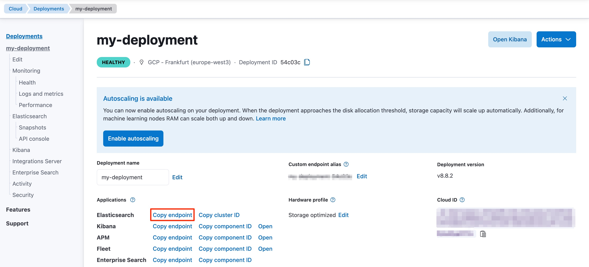

---
mapped_pages:
  - https://www.elastic.co/guide/en/elasticsearch/client/net-api/current/getting-started-net.html
  - https://www.elastic.co/guide/en/serverless/current/elasticsearch-dot-net-client-getting-started.html
---

# Getting started [getting-started-net]

This page guides you through the installation process of the .NET client, shows you how to instantiate the client, and how to perform basic Elasticsearch operations with it.

### Requirements [_requirements]

* .NET Core, .NET 5+ or .NET Framework (4.6.1 and higher).

### Installation [_installation]

To install the latest version of the client for SDK style projects, run the following command:

```shell
dotnet add package Elastic.Clients.Elasticsearch
```

Refer to the [*Installation*](/reference/installation.md) page to learn more.

### Connecting [_connecting]

You can connect to the Elastic Cloud using an API key and the Elasticsearch endpoint.

```csharp
var client = new ElasticsearchClient("<CLOUD_ID>", new ApiKey("<API_KEY>"));
```

Your Elasticsearch endpoint can be found on the **My deployment** page of your deployment:



You can generate an API key on the **Management** page under Security.


For other connection options, refer to the [*Connecting*](/reference/connecting.md) section.

### Operations [_operations]

Time to use Elasticsearch! This section walks you through the basic, and most important, operations of Elasticsearch. For more operations and more advanced examples, refer to the [*CRUD usage examples*](/reference/examples.md) page.


#### Creating an index [_creating_an_index]

This is how you create the `my_index` index:

```csharp
var response = await client.Indices.CreateAsync("my_index");
```

#### Indexing documents [_indexing_documents]

This is a simple way of indexing a document:

```csharp
var doc = new MyDoc
{
    Id = 1,
    User = "flobernd",
    Message = "Trying out the client, so far so good?"
};

var response = await client.IndexAsync(doc, x => x.Index("my_index"));
```

#### Getting documents [_getting_documents]

You can get documents by using the following code:

```csharp
var response = await client.GetAsync<MyDoc>("my-index", id);

if (response.IsValidResponse)
{
    var doc = response.Source;
}
```

#### Searching documents [_searching_documents]

This is how you can create a single match query with the .NET client:

```csharp
var response = await client.SearchAsync<Person>(s => s
    .Indices("my_index")
    .From(0)
    .Size(10)
    .Query(q => q
        .Term(t => t
            .Field(x => x.User)
            .Value("flobernd")
        )
    )
);

if (response.IsValidResponse)
{
    var doc = response.Documents.FirstOrDefault();
}
```

#### Updating documents [_updating_documents]

This is how you can update a document, for example to add a new field:

```csharp
doc.Message = "This is a new message";

var response = await client.UpdateAsync<MyDoc, MyDoc>("my_index", id, u => u
    .Doc(doc)
);
```

#### Deleting documents [_deleting_documents]

```csharp
var response = await client.DeleteAsync("my_index", id);
```

#### Deleting an index [_deleting_an_index]

```csharp
var response = await client.Indices.DeleteAsync("my_index");
```

## Further reading [_further_reading]

* Refer to the [*Usage recommendations*](/reference/recommendations.md) page to learn more about how to use the client the most efficiently.
